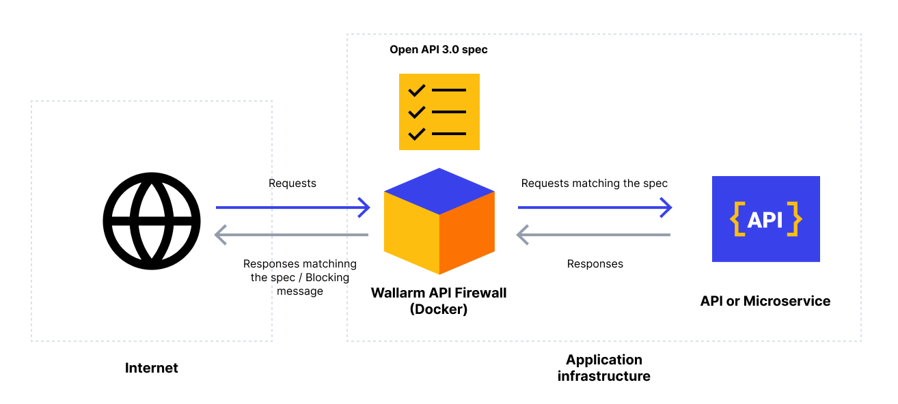

# Wallarm API Firewall

Light-weighted Wallarm API Firewall protects your API endpoints in cloud-native environments with API schema validation. Wallarm API Firewall relies on a positive security model allowing calls that match a predefined API specification, while rejecting everything else.

## API schema validation and positive security model

When starting API Firewall, you should provide the [OpenAPI 3.0 specification](https://swagger.io/specification/) of the application to be protected with API Firewall. The started API Firewall will operate as a reverse proxy and validate whether requests and responses match the schema defined in the specification. The traffic that does not match the schema will be blocked or logged (depending on the configured API Firewall operation mode).

Provided API schema should be described using the [OpenAPI 3.0 specification](https://swagger.io/specification/) in the YAML or JSON file (`.yaml`, `.yml`, `.json` file extensions).

By allowing you to set the traffic requirements with the OpenAPI 3.0 specification, Wallarm API Firewall relies on a positive security model.

## Technical characteristics

API Firewall works as a reverse proxy with a built-in OpenAPI 3.0 request and response validator. The validator is written in Go and optimized for extreme performance and near-zero added latency.

## Quick start

To download, install, and start Wallarm API Firewall on Docker, see the [instructions](https://docs.wallarm.com/api-firewall/installation-guides/docker-container/).

## Demos

You can try API Firewall by running the demo environment that deploys an example application protected with Wallarm API Firewall. There are two available demo environments:

* [Wallarm API Firewall demo with Docker Compose](https://github.com/wallarm/api-firewall/tree/main/demo/docker-compose)
* [Wallarm API Firewall demo with Kubernetes](https://github.com/wallarm/api-firewall/tree/main/demo/kubernetes)
